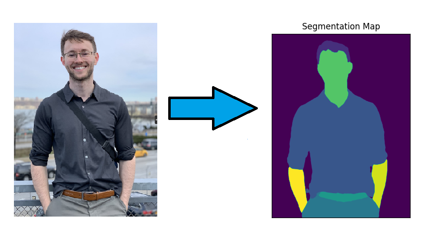
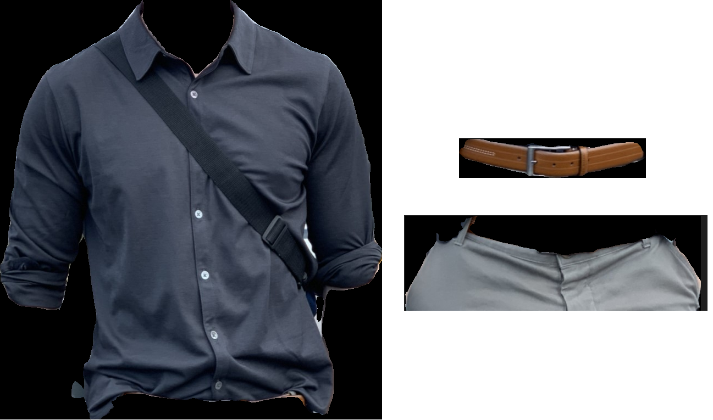
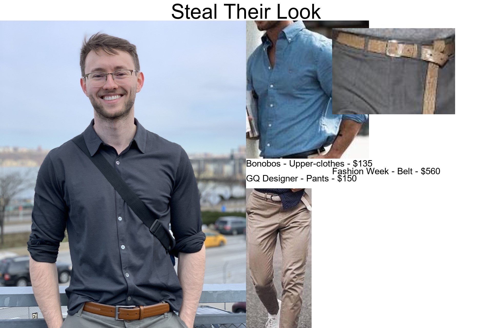

## Alexander Moore

I am a PhD A.I. research scientist at Lawrence Livermore National Labratory.

Previously advised by [Professor Randy Paffenroth](https://users.wpi.edu/~rcpaffenroth/) for a PhD in Machine Learning 2019-2023.

[My research](https://scholar.google.com/citations?user=Uq_mfNsAAAAJ&hl=en&oi=sra){:target="_blank" rel="noopener"} spans computer vision, foundation models, stable fine-tuning, and transfer learning for deep neural networks to improve real-world  application performance.

### Select Publicaations and Projects
[Google Scholar](https://scholar.google.com/citations?user=Uq_mfNsAAAAJ&hl=en&oi=sra){:target="_blank" rel="noopener"}

* [ChemVise: Maximizing Out-of-Distribution Chemical Detection with the Novel Application of Zero-Shot Learning](https://arxiv.org/abs/2302.04917){:target="_blank" rel="noopener"}
    - **International Conference on Machine Learning and Applications** 2023
    - Oral presentation and paper

* [ACGANs Improve Chemical Sensors for Challenging Distributions](https://conferences.computer.org/icmlapub/pdfs/ICMLA2022-1oIbEyrqlxdYNqIVuUdynF/628300a286/628300a286.pdf){:target="_blank" rel="noopener"}
    - **International Conference on Machine Learning and Applications** 2022
    - Oral presentation and paper
    
* [Cycles Improve Conditional Generators](https://link.springer.com/chapter/10.1007/978-3-031-22137-8_26){:target="_blank" rel="noopener"}
    - **International Conference on Advanced Data Mining and Applications** 2022
    - Paper and poster
    
* [Identifying Strugging Students by Comparing Online Tutor Clickstreams](https://link.springer.com/chapter/10.1007%2F978-3-030-78270-2_52){:target="_blank" rel="noopener"}
    - **Artificial Intelligence in Education** 2021
    - Short paper and poster
    
* [Identifying Explanations Within Student-Tutor Chatlogs](https://educationaldatamining.org/edm2022/proceedings/2022.EDM-doctoral-consortium.100/){:target="_blank" rel="noopener"}
    - **International Conference on Educational Data Mining** 2022

<!-- a normal html comment
* [ChemVise: Maximizing Out-of-Distribution Chemical Detection with the Novel Application of Zero-Shot Learning](https://arxiv.org/abs/2302.04917){:target="_blank" rel="noopener"}
    - **Preprint** for semantic transfer of molecular representation chemistry corpus
 -->
 
* [Model-Agnostic Meta Learning for Remote Sensing](https://github.com/alexander-moore/MAML-Augmentation){:target="_blank" rel="noopener"}
    - **Deep Learning** Final Project 2021

* [Benchmarking Policy Gradient and DQN-Family Reinforcement Learning Models on Discrete and Continuous Games](https://github.com/alexander-moore/CS525){:target="_blank" rel="noopener"}
    - **Reinforcement Learning** Final Project 2020

### Education and Awards
* Worcester Polytechnic Institute, Worcester Massachusetts
    - Ph.D. - Data Science 2021 - 2023. 4.0/4.0 GPA
    - M.S. - Data Science 2019 - 2021. 4.0/4.0 GPA
    - $90,000 Annual Presidential Fellowship Award

* Reed College, Portland Oregon
    - Bachelor of Arts - Mathematics and Statistics 2016 - 2019
    - Presidential Commendation for Excellence
    - Dean's List 2016 - 2017

<!--
<figure>
  
  <figcaption>This is my caption text.</figcaption>
</figure>

This is text that comes after my caption text

-->
